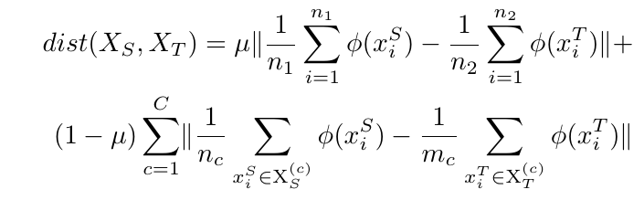
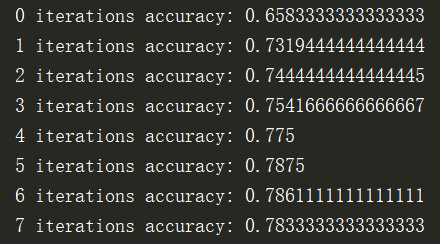
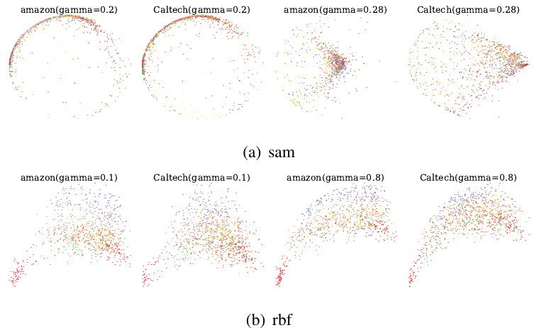

# Balanced Distribution Adaptation

### INTRODUCTION
- A non-deep distribution adaptation method to decrease the MMD
 between source and target domain for machine learning. \
  

- $$dist(X_{S},X_{T})=\mu \lVert\frac{1}{n_{1}}\sum\limits_{i=1}^{n_{1}}\phi(x^{S}_{i})-\frac{1}{n_{2}}\sum\limits_{i=1}^{n_{2}}\phi(x^{T}_{i})\rVert +\\
 (1-\mu)\sum\limits_{c=1}^{C}\lVert\frac{1}{n_{c}}\sum\limits_{x^{S}_{i}\in \mathrm{X}_{S}^{(c)}}\phi(x^{S}_{i})-\frac{1}{m_{c}}\sum\limits_{x^{T}_{i}\in \mathrm{X}_{T}^{(c)}}\phi(x^{T}_{i})\rVert $$
----------------------------------------------
### NEW FEATURE
- Different from original BDA,
when limited labeled data can be obtained on target
domain, they could be used to improve the performance.
----------------------------------------------
### HOW TO USE
- Z, _ = fit_transform(X_src,Y_src,X_tar,Y_tar,X_tar_l,Y_tar_l) \
- X_src = Z.T[:n_src]
- X_tar = Z.T[n_src:]
----------------------------------------------

### RESULT
- accuracy on coil1: \
  

- feature visualization under different kernel param when
 decompose feature to 2 dimensions. \
  

----------------------------------------------
### REFERENCE
[1] *Wang J, Chen Y, Hao S, et al. Balanced Distribution Adaptation for Transfer Learning[C]// IEEE International Conference on Data Mining. IEEE, 2017:1129-1134.*
### CONCAT
pyk3350266@163.com